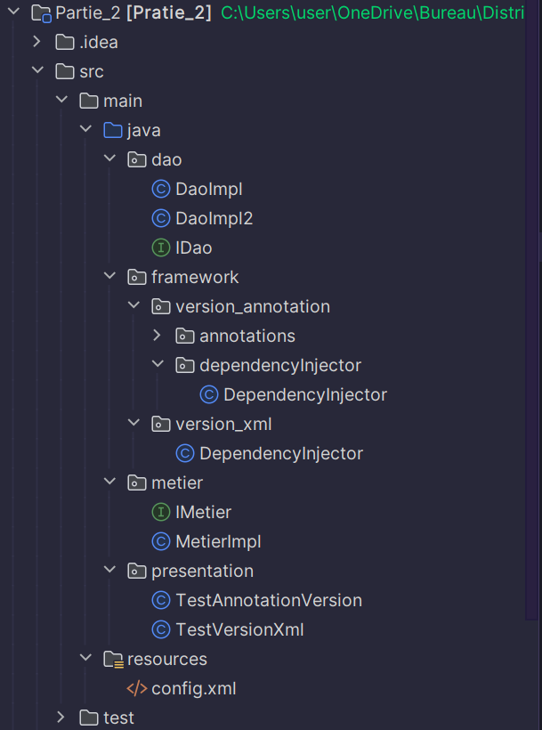

<h1 style="text-align: center">Compte Rendu</h1>

<h2>Introduction</h2>

Ce compte rendu se concentre sur deux parties essentielles liées à la gestion des dépendances dans le développement logiciel. 
Dans la première partie, nous explorons diverses techniques de gestion des dépendances, de la création d'interfaces et d'implémentations à l'injection de dépendances, en passant par l'utilisation du Framework Spring. 
Dans la deuxième partie, nous présentons un mini-projet axé sur le développement d'un Framework d'injection de dépendances, similaire à Spring IOC, offrant une solution personnalisée pour simplifier la gestion des dépendances dans les applications. 
Dans la première partie, nous commençons par la définition de deux interfaces, IDao et IMetier, représentant respectivement les opérations de récupération de données et de calcul métier. En développant des implémentations pour ces interfaces, nous mettons l'accent sur le couplage faible pour favoriser la modularité et la flexibilité du système. Nous explorons ensuite différentes méthodes d'injection de dépendances, de l'instanciation statique à l'utilisation du Framework Spring, en passant par l'instanciation dynamique. 
Dans la deuxième partie, nous concevons et créons un mini Framework d'injection de dépendances qui permet aux programmeurs de gérer les dépendances entre les différents composants de leur application. Ce Framework offre deux approches de configuration : via un fichier XML et via l'utilisation d'annotations directement dans le code source. Il propose également trois méthodes d'injection : par le constructeur, par le Setter, ou directement via l'attribut (Field), offrant ainsi une flexibilité maximale dans la gestion des dépendances. Ce compte rendu détaillera chaque étape de manière à offrir une compréhension approfondie des techniques utilisées pour gérer les dépendances dans un système logiciel, ainsi que la conception et la mise en œuvre pratique d'un Framework d'injection de dépendances personnalisé. Des exemples concrets d'utilisation seront fournis pour illustrer la mise en œuvre pratique de ces concepts dans des applications réelles.

<h2>Partie 1</h2>

<ol>
    <li>
        
Créer l'interface IDao avec une méthode getData() :

        <pre><code>package dao;

public interface IDao {
// Interface définissant une méthode pour obtenir des données
double getData();
}</code></pre>
</li>
<li>

Créer une implémentation de cette interface :

<pre><code>package dao;

import org.springframework.stereotype.Component;

@Component("v1")
public class DaoImpl implements IDao {
// Implémentation de l'interface IDao
@Override
public double getData() {
System.out.println("version 1: ");
double temp = 1;
return temp;
}
}</code></pre>
</li>
<li>

Créer l'interface IMetier avec une méthode calcul :

<pre><code>package metier;

public interface IMetier {
// Interface définissant une méthode de calcul
double calcul();
}</code></pre>
</li>
<li>

Créer une implémentation de cette interface en utilisant le couplage faible :

<pre><code>package metier;

import dao.IDao;
import org.springframework.beans.factory.annotation.Autowired;
import org.springframework.beans.factory.annotation.Qualifier;
import org.springframework.stereotype.Component;

@Component
public class MetierImpl implements IMetier {
// Implémentation de l'interface IMetier avec injection de dépendance
@Autowired
@Qualifier("v1")
private IDao dao;

@Override
public double calcul() {
// Méthode de calcul utilisant les données obtenues via l'interface IDao
double res = dao.getData();
return res * 100;
    }

public void setDao(IDao dao) {
        this.dao = dao;
    }
}</code></pre>
</li>
<li>

Faire l'injection des dépendances :

<ol type="a">
<li>

Par instanciation statique :

<pre><code>package presentation;

import dao.DaoImpl;
import metier.MetierImpl;

public class Presentation_statique {
public static void main(String[] args) {
// Création des objets et injection des dépendances de manière statique
DaoImpl dao = new DaoImpl();
MetierImpl metier = new MetierImpl();
metier.setDao(dao);
System.out.println(metier.calcul());
}
}</code></pre>
</li>
<li>

Par instanciation dynamique :

<pre><code>package presentation;

import dao.IDao;
import metier.IMetier;

import java.io.File;
import java.lang.reflect.Method;
import java.util.Scanner;

public class Presentation_dynamique {
public static void main(String[] args) throws Exception {
// Chargement dynamique des classes à partir d'un fichier de configuration
Scanner scanner = new Scanner(new File("src/main/resources/config.txt"));
String daoClassName = scanner.nextLine();
Class cDao = Class.forName(daoClassName);
IDao dao = (IDao) cDao.getConstructor().newInstance();
String metierClassName = scanner.nextLine();
Class cMetier = Class.forName(metierClassName);
IMetier metier = (IMetier) cMetier.getConstructor().newInstance();
Method setDao = cMetier.getDeclaredMethod("setDao", IDao.class);
setDao.invoke(metier, dao);
System.out.println(metier.calcul());
    }
}</code></pre>
</li>
<li>

En utilisant le Framework Spring :

<ul>
<li>

Version XML :

<pre><code>package presentation;

import metier.IMetier;
import org.springframework.context.ApplicationContext;
import org.springframework.context.support.ClassPathXmlApplicationContext;

public class Presentation_Spring_XML {
public static void main(String[] args) {
// Utilisation de Spring avec configuration XML
ApplicationContext springContext = new ClassPathXmlApplicationContext("config.xml");
IMetier metier = springContext.getBean(IMetier.class);
System.out.println(metier.calcul());
}
}</code></pre>
</li>
<li>

Version annotations :

<pre><code>package presentation;

import metier.IMetier;
import org.springframework.context.ApplicationContext;
import org.springframework.context.annotation.AnnotationConfigApplicationContext;

public class Presentation_Spring_Annotation {
public static void main(String[] args) {
// Utilisation de Spring avec annotations
ApplicationContext context = new AnnotationConfigApplicationContext("dao", "metier");
IMetier metier = context.getBean(IMetier.class);
System.out.println(metier.calcul());
}
}</code></pre>
</li>
</ul>
</li>
</ol>
</li>
</ol>

<h2>Partie 2</h2>

<h3>Structure du projet</h4>

<h3>Injection des dependances a travers un fichier XML</h3>
<ol>
    <li>
        
Créer la classe DependencyInjector

        <pre><code>package framework.version_xml;

import javax.xml.parsers.DocumentBuilderFactory;
import javax.xml.parsers.DocumentBuilder;
import org.w3c.dom.Document;
import org.w3c.dom.Element;
import org.w3c.dom.NodeList;
import java.io.File;
import java.util.HashMap;
import java.util.Map;

public class DependencyInjector {
    private Map<String, Object> components = new HashMap<>();
    public void loadConfig(String configFile) {
        try {
            File file = new File(configFile);
            DocumentBuilderFactory dbFactory = DocumentBuilderFactory.newInstance();
            DocumentBuilder dBuilder = dbFactory.newDocumentBuilder();
            Document doc = dBuilder.parse(file);
            doc.getDocumentElement().normalize();
            NodeList componentNodes = doc.getElementsByTagName("component");
            for (int i = 0; i < componentNodes.getLength(); i++) {
                Element componentElement = (Element) componentNodes.item(i);
                String componentName = componentElement.getAttribute("name");
                String componentClass = componentElement.getAttribute("class");
                // Get constructor with no parameters
                Object componentInstance = Class.forName(componentClass).getDeclaredConstructor().newInstance();
                components.put(componentName, componentInstance);
            }
        } catch (Exception e) {
            e.printStackTrace();
        }
    }
    public <T> T getComponent(String name, Class<T> type) {
        return type.cast(components.get(name));
    }
    // Add a method to register components with constructor parameters
    public void registerComponent(String name, Object componentInstance) {
        components.put(name, componentInstance);
    }
}
</code></pre>
</li>
<li>
    
Créer le fichier configuration "config.xml"

    <pre><code>
&lt;config&gt;
    &lt;component name="metier" class="metier.MetierImpl"&gt;
        &lt;property name="dao" ref="dao"/&gt;
    &lt;/component&gt;
    &lt;component name="dao" class="dao.DaoImpl"/&gt;
&lt;/config&gt;
    </code></pre>
</li>

<li>

Créer la classe TestVersionXml pour tester:

<pre><code>package presentation;

import dao.IDao;
import framework.version_xml.DependencyInjector;
import metier.MetierImpl;

public class TestVersionXml {
    public static void main(String[] args) {
        DependencyInjector injector = new DependencyInjector();
        injector.loadConfig("src/main/resources/config.xml");
        MetierImpl metier = injector.getComponent("metier", MetierImpl.class);
        IDao dao = injector.getComponent("dao", IDao.class);
        metier.setDao(dao);
        System.out.println(metier.calcul());
        }
}
</code></pre>

</li>

<h3>Injection des dependances a travers les Annotations</h3>
<ol>
<li>

Créer de la classe DependencyInjector:

Cette classe permet de scanner les packages pour trouver les classes marquées avec l'annotation "@Component" pour faire L'injection des dependances via 2 mecanismes:
<ol>
<li>Par constructeur : Le conteneur examine les constructeurs des classes annotées avec @Component et utilise celui qui est annoté avec @Autowired pour résoudre les dépendances</li>
<li>Par méthode setter : Le conteneur recherche les méthodes setter dans les classes annotées avec @Component, et s'il trouve une méthode annotée avec @Autowired, il injecte la dépendance appropriée via cette méthode.</li>
</ol>
<pre><code>
package framework.version_annotation.dependencyInjector;

import dao.DaoImpl;
import framework.version_annotation.annotations.Autowired;
import framework.version_annotation.annotations.Component;
import metier.MetierImpl;

import java.lang.reflect.Constructor;
import java.lang.reflect.InvocationTargetException;
import java.lang.reflect.Method;
import java.util.Arrays;
import java.util.HashMap;
import java.util.List;
import java.util.Map;

@Component
public class DependencyInjector {
private final Map<Class<?>, Object> components = new HashMap<>();
    public DependencyInjector(String... basePackages) {
        // Scan base packages for classes marked with @Component
        for (String basePackage : basePackages) {
            List<Class<?>> classes = scanPackage(basePackage);
            for (Class<?> clazz : classes) {
                if (clazz.isAnnotationPresent(Component.class)) {
                    try {
                        Object instance = createInstance(clazz);
                        components.put(clazz, instance);
                    } catch (InstantiationException | IllegalAccessException | InvocationTargetException | NoSuchMethodException e) {
                        e.printStackTrace();
                    }
                }
            }
        }
        // Wire dependencies
        for (Object component : components.values()) {
            wireDependencies(component);
        }
    }
    private List<Class<?>> scanPackage(String basePackage) {
        // Implement package scanning logic here
        // This can be done using libraries like Reflections or by manual scanning
        // For simplicity, let's assume we already have a list of classes in the base package
        return Arrays.asList(DaoImpl.class, MetierImpl.class);
    }
    private Object createInstance(Class<?> clazz) throws IllegalAccessException, InvocationTargetException, InstantiationException, NoSuchMethodException {
        Constructor<?>[] constructors = clazz.getConstructors();
        for (Constructor<?> constructor : constructors) {
            if (constructor.isAnnotationPresent(Autowired.class)) {
                Class<?>[] parameterTypes = constructor.getParameterTypes();
                Object[] parameters = new Object[parameterTypes.length];
                for (int i = 0; i < parameterTypes.length; i++) {
                    parameters[i] = components.get(parameterTypes[i]);
                }
                return constructor.newInstance(parameters);
            }
        }
        return clazz.getDeclaredConstructor().newInstance();
    }
    private void wireDependencies(Object component) {
        Class<?> clazz = component.getClass();
        // Setter injection
        for (Method method : clazz.getMethods()) {
            if (method.isAnnotationPresent(Autowired.class) && method.getName().startsWith("set") && method.getParameterCount() == 1) {
                Class<?> parameterType = method.getParameterTypes()[0];
                Object dependency = components.get(parameterType);
                if (dependency != null) {
                    try {
                        method.invoke(component, dependency);
                    } catch (IllegalAccessException | InvocationTargetException e) {
                        e.printStackTrace();
                    }
                }
            }
        }
    }
    public <T> T getComponent(Class<T> type) {
        Object component = components.get(type);
        if (component != null) {
            return type.cast(component);
        }
        return null;
    }
}

</code>
</pre>

</li>

<li>

Pour cela on doit creer les annotations @Component et @Autowired

<pre>
<code>
package framework.version_annotation.annotations;

import java.lang.annotation.*;

@Retention(RetentionPolicy.RUNTIME)
@Target({ElementType.FIELD, ElementType.CONSTRUCTOR, ElementType.METHOD})
public @interface Autowired {

}

</code>
<code>
package framework.version_annotation.annotations;

import java.lang.annotation.*;

@Retention(RetentionPolicy.RUNTIME)
@Target(ElementType.TYPE)
public @interface Component {

}

</code>
</pre>
</li>

<li>

Créer la classe TestAnnotationVersion pour tester les 2 types d'injections

<pre>
<code>
package presentation;

import framework.version_annotation.dependencyInjector.DependencyInjector;
import dao.DaoImpl;
import metier.MetierImpl;

public class TestAnnotationVersion {
public static void main(String[] args) {
        // Via setters
        DependencyInjector injector = new DependencyInjector("dao", "metier");
        // Attempt to retrieve instances of DaoImpl and MetierImpl directly
        DaoImpl daoImpl = injector.getComponent(DaoImpl.class);
        MetierImpl metierImpl = injector.getComponent(MetierImpl.class);
        metierImpl.setDao(daoImpl);
        System.out.println(metierImpl.calcul());
        // Via constructor
        DependencyInjector injector_constructor = new DependencyInjector("dao", "metier");
        MetierImpl metierImpl_constructor = injector_constructor.getComponent(MetierImpl.class);
        System.out.println(metierImpl_constructor.calcul());
    }
}

</code>
</pre>
</li>
</ol>

</ol>