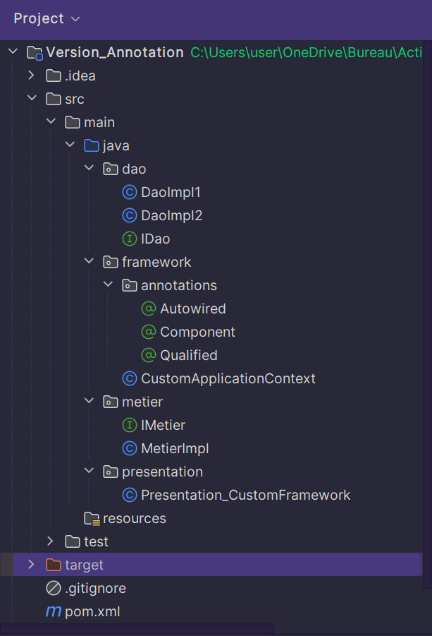

<h1 style="text-align: center">Compte Rendu</h1>

<h2>Introduction</h2>

Ce compte rendu se concentre sur deux parties essentielles liées à la gestion des dépendances dans le développement logiciel. 
Dans la première partie, nous explorons diverses techniques de gestion des dépendances, de la création d'interfaces et d'implémentations à l'injection de dépendances, en passant par l'utilisation du Framework Spring. 
Dans la deuxième partie, nous présentons un mini-projet axé sur le développement d'un Framework d'injection de dépendances, similaire à Spring IOC, offrant une solution personnalisée pour simplifier la gestion des dépendances dans les applications. 
Dans la première partie, nous commençons par la définition de deux interfaces, IDao et IMetier, représentant respectivement les opérations de récupération de données et de calcul métier. En développant des implémentations pour ces interfaces, nous mettons l'accent sur le couplage faible pour favoriser la modularité et la flexibilité du système. Nous explorons ensuite différentes méthodes d'injection de dépendances, de l'instanciation statique à l'utilisation du Framework Spring, en passant par l'instanciation dynamique. 
Dans la deuxième partie, nous concevons et créons un mini Framework d'injection de dépendances qui permet aux programmeurs de gérer les dépendances entre les différents composants de leur application. Ce Framework offre deux approches de configuration : via un fichier XML et via l'utilisation d'annotations directement dans le code source. Il propose également trois méthodes d'injection : par le constructeur, par le Setter, ou directement via l'attribut (Field), offrant ainsi une flexibilité maximale dans la gestion des dépendances. Ce compte rendu détaillera chaque étape de manière à offrir une compréhension approfondie des techniques utilisées pour gérer les dépendances dans un système logiciel, ainsi que la conception et la mise en œuvre pratique d'un Framework d'injection de dépendances personnalisé. Des exemples concrets d'utilisation seront fournis pour illustrer la mise en œuvre pratique de ces concepts dans des applications réelles.

<h2>Partie 1</h2>

<ol>
    <li>
        
Créer l'interface IDao avec une méthode getData() :

        <pre><code>package dao;

public interface IDao {
// Interface définissant une méthode pour obtenir des données
double getData();
}</code></pre>
</li>
<li>

Créer une implémentation de cette interface :

<pre><code>package dao;

import org.springframework.stereotype.Component;

@Component("v1")
public class DaoImpl implements IDao {
// Implémentation de l'interface IDao
@Override
public double getData() {
System.out.println("version 1: ");
double temp = 1;
return temp;
}
}</code></pre>
</li>
<li>

Créer l'interface IMetier avec une méthode calcul :

<pre><code>package metier;

public interface IMetier {
// Interface définissant une méthode de calcul
double calcul();
}</code></pre>
</li>
<li>

Créer une implémentation de cette interface en utilisant le couplage faible :

<pre><code>package metier;

import dao.IDao;
import org.springframework.beans.factory.annotation.Autowired;
import org.springframework.beans.factory.annotation.Qualifier;
import org.springframework.stereotype.Component;

@Component
public class MetierImpl implements IMetier {
// Implémentation de l'interface IMetier avec injection de dépendance
@Autowired
@Qualifier("v1")
private IDao dao;

@Override
public double calcul() {
// Méthode de calcul utilisant les données obtenues via l'interface IDao
double res = dao.getData();
return res * 100;
    }

public void setDao(IDao dao) {
        this.dao = dao;
    }
}</code></pre>
</li>
<li>

Faire l'injection des dépendances :

<ol type="a">
<li>

Par instanciation statique :

<pre><code>package presentation;

import dao.DaoImpl;
import metier.MetierImpl;

public class Presentation_statique {
public static void main(String[] args) {
// Création des objets et injection des dépendances de manière statique
DaoImpl dao = new DaoImpl();
MetierImpl metier = new MetierImpl();
metier.setDao(dao);
System.out.println(metier.calcul());
}
}</code></pre>
</li>
<li>

Par instanciation dynamique :

<pre><code>package presentation;

import dao.IDao;
import metier.IMetier;

import java.io.File;
import java.lang.reflect.Method;
import java.util.Scanner;

public class Presentation_dynamique {
public static void main(String[] args) throws Exception {
// Chargement dynamique des classes à partir d'un fichier de configuration
Scanner scanner = new Scanner(new File("src/main/resources/config.txt"));
String daoClassName = scanner.nextLine();
Class cDao = Class.forName(daoClassName);
IDao dao = (IDao) cDao.getConstructor().newInstance();
String metierClassName = scanner.nextLine();
Class cMetier = Class.forName(metierClassName);
IMetier metier = (IMetier) cMetier.getConstructor().newInstance();
Method setDao = cMetier.getDeclaredMethod("setDao", IDao.class);
setDao.invoke(metier, dao);
System.out.println(metier.calcul());
    }
}</code></pre>
</li>
<li>

En utilisant le Framework Spring :

<ul>
<li>

Version XML :

<pre><code>package presentation;

import metier.IMetier;
import org.springframework.context.ApplicationContext;
import org.springframework.context.support.ClassPathXmlApplicationContext;

public class Presentation_Spring_XML {
public static void main(String[] args) {
// Utilisation de Spring avec configuration XML
ApplicationContext springContext = new ClassPathXmlApplicationContext("config.xml");
IMetier metier = springContext.getBean(IMetier.class);
System.out.println(metier.calcul());
}
}</code></pre>
</li>
<li>

Version annotations :

<pre><code>package presentation;

import metier.IMetier;
import org.springframework.context.ApplicationContext;
import org.springframework.context.annotation.AnnotationConfigApplicationContext;

public class Presentation_Spring_Annotation {
public static void main(String[] args) {
// Utilisation de Spring avec annotations
ApplicationContext context = new AnnotationConfigApplicationContext("dao", "metier");
IMetier metier = context.getBean(IMetier.class);
System.out.println(metier.calcul());
}
}</code></pre>
</li>
</ul>
</li>
</ol>
</li>
</ol>

<h2>Partie 2</h2>

<h3>Structure du projet</h4>
<h3>Injection des dependances a travers un fichier XML</h3>
<ol>
    <li>
        
Créer la classe DependencyInjector

        <pre><code>package framework.version_xml;

import org.w3c.dom.Document;
import org.w3c.dom.Element;
import org.w3c.dom.NodeList;

import javax.xml.parsers.DocumentBuilder;
import javax.xml.parsers.DocumentBuilderFactory;
import java.io.File;
import java.util.HashMap;
import java.util.Map;

public class DependencyInjector {
private Map<String, Object> beans = new HashMap<>();
    public DependencyInjector(String configFile) throws Exception {
        File file = new File(configFile);
        DocumentBuilderFactory dbFactory = DocumentBuilderFactory.newInstance();
        DocumentBuilder dBuilder = dbFactory.newDocumentBuilder();
        Document doc = dBuilder.parse(file);
        doc.getDocumentElement().normalize();
        NodeList nodeList = doc.getElementsByTagName("bean");
        for (int i = 0; i < nodeList.getLength(); i++) {
            Element element = (Element) nodeList.item(i);
            String id = element.getAttribute("id");
            String className = element.getAttribute("class");
            Object bean = Class.forName(className).newInstance();
            NodeList propertyNodes = element.getElementsByTagName("property");
            for (int j = 0; j < propertyNodes.getLength(); j++) {
                Element propertyElement = (Element) propertyNodes.item(j);
                String propertyName = propertyElement.getAttribute("name");
                String refName = propertyElement.getAttribute("ref");
                Object refBean = beans.get(refName);
                if (refBean == null) {
                    throw new IllegalArgumentException("Dépendance non trouvée : " + refName);
                }
                bean.getClass().getMethod("set" + propertyName.substring(0, 1).toUpperCase() + propertyName.substring(1), refBean.getClass().getInterfaces()[0]).invoke(bean, refBean);
            }
            beans.put(id, bean);
        }
    }
    public Object getBean(String beanName) {
        return beans.get(beanName);
    }
}

</code></pre>
</li>
<li>
    
Créer le fichier configuration "config.xml"

    <pre><code>
&lt;?xml version="1.0" encoding="UTF-8"?&gt;
&lt;config&gt;
    &lt;bean id="dao" class="DaoImpl1"/&gt;
    &lt;bean id="metier" class="MetierImpl"&gt;
        &lt;property name="dao" ref="dao"/&gt;
    &lt;/bean&gt;
&lt;/config&gt;
    </code></pre>
</li>

<li>

Créer la classe PresentationWithoutSpring pour tester:

<pre><code>package presentation;

public class PresentationWithoutSpring {
public static void main(String[] args) {
try {
DependencyInjector injector = new DependencyInjector("src/main/resources/config.xml");
IMetier metier = (IMetier) injector.getBean("metier");
System.out.println(metier.calcul());
} catch (Exception e) {
e.printStackTrace();
}
}
}

</code></pre>

</li>

<h3>Injection des dependances a travers les Annotations</h3>

<ol>
<li>

Créer de la classe DependencyInjector:

Cette classe est responsable de la gestion des beans et de l'injection de dépendances dans une application Java. Elle offre un mécanisme de configuration flexible basé sur des annotations pour faciliter la gestion des dépendances.

<h3>Membres</h3>

<ul>
  <li><code>beans</code>: Une carte associant des noms de beans à des instances d'objets.</li>
</ul>

<h3>Constructeur</h3>

<ul>
  <li><code>CustomApplicationContext(String... packageNames)</code>: Le constructeur prend en paramètre une liste de noms de packages à scanner pour les composants à instancier. Il instancie automatiquement les beans et résout les dépendances entre eux.</li>
</ul>

<h3>Méthodes</h3>

<ul>
  <li><code>getBean(String beanName)</code>: Renvoie l'instance du bean correspondant au nom spécifié.</li>
</ul>

<h3>Méthodes privées</h3>

<ul>
  <li><code>instantiateBeans(String packageName)</code>: Cette méthode instancie les beans enregistrés dans les packages spécifiés. Actuellement, elle instancie manuellement quelques implémentations spécifiques (MetierImpl, DaoImpl1, DaoImpl2).</li>
  <li><code>autowireDependencies()</code>: Cette méthode utilise la réflexion pour parcourir tous les champs des beans et injecter automatiquement les dépendances annotées avec <code>@Autowired</code>. Si un champ est également annoté avec <code>@Qualified</code>, il utilise une annotation de qualification pour identifier la dépendance appropriée à injecter.</li>
</ul>
<pre><code>
package framework;

import dao.DaoImpl1;
import dao.DaoImpl2;
import framework.annotations.Autowired;
import framework.annotations.Component;
import framework.annotations.Qualified;
import metier.MetierImpl;

import java.lang.reflect.Field;
import java.util.HashMap;
import java.util.Map;

public class CustomApplicationContext {
private Map<String, Object> beans = new HashMap<>();
    public CustomApplicationContext(String... packageNames) {
        // Scan packageNames and instantiate beans
        for (String packageName : packageNames) {
            instantiateBeans(packageName);
        }
        // Autowire dependencies
        autowireDependencies();
    }
    public Object getBean(String beanName) {
        return beans.get(beanName);
    }
    private void instantiateBeans(String packageName) {
        beans.put("metier", new MetierImpl());
        beans.put("daoImplV1", new DaoImpl1());
        beans.put("daoImplV2", new DaoImpl2());
    }
    private void autowireDependencies() {
        for (Object bean : beans.values()) {
            // Use reflection to find fields annotated with @Autowired
            Field[] fields = bean.getClass().getDeclaredFields();
            for (Field field : fields) {
                if (field.isAnnotationPresent(Autowired.class)) {
                    // Find corresponding beans from beans map and inject them
                    try {
                        field.setAccessible(true);
                        if (field.isAnnotationPresent(Qualified.class)) {
                            String qualifier = field.getAnnotation(Qualified.class).value();
                            field.set(bean, beans.get(qualifier));
                        } else {
                            field.set(bean, getBean(field.getName()));
                        }
                    } catch (IllegalAccessException e) {
                        e.printStackTrace();
                    }
                }
            }
        }
    }
}

</code>
</pre>

</li>

<li>

Pour cela on doit creer les annotations @Component, @Autowired et @Qualified

<pre>
<code>
package framework.annotations;

import java.lang.annotation.ElementType;
import java.lang.annotation.Retention;
import java.lang.annotation.RetentionPolicy;
import java.lang.annotation.Target;

@Retention(RetentionPolicy.RUNTIME)
@Target(ElementType.FIELD)
public @interface Autowired {
}

</code>
<code>
package framework.annotations;

import java.lang.annotation.*;

@Retention(RetentionPolicy.RUNTIME)
@Target(ElementType.TYPE)
public @interface Component {
String value() default "";
}

</code>
<code>
package framework.annotations;

import java.lang.annotation.*;

@Retention(RetentionPolicy.RUNTIME)
@Target(ElementType.FIELD)
public @interface Qualified {
String value();
}

</code>
</pre>
</li>

<li>

Créer la classe Presentation_CustomFramework pour tester:

<pre>
<code>
package presentation;

import framework.CustomApplicationContext;
import metier.IMetier;

public class Presentation_CustomFramework {
public static void main(String[] args) {
CustomApplicationContext context = new CustomApplicationContext("dao", "metier");
IMetier metier = (IMetier) context.getBean("metier");
System.out.println("Result: " + metier.calcul());
}
}

</code>
</pre>
</li>
</ol>

</ol>